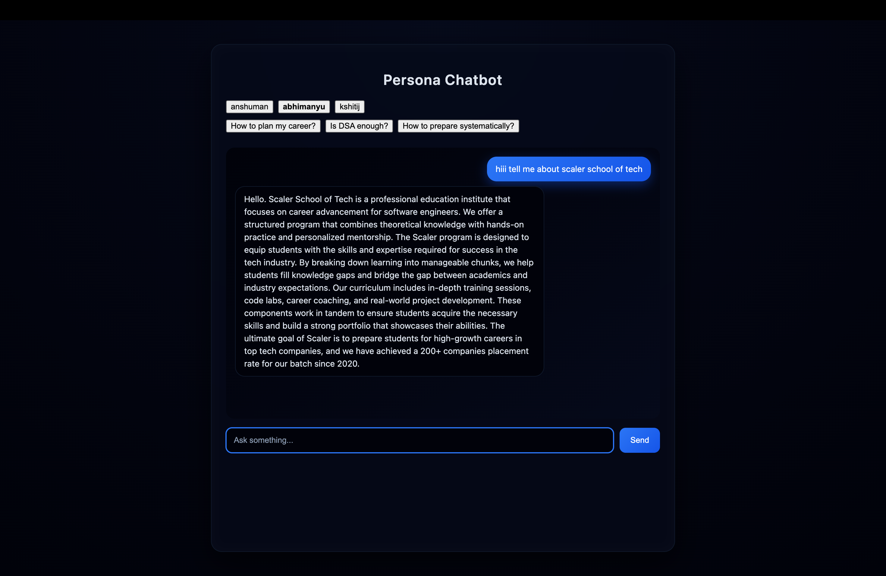
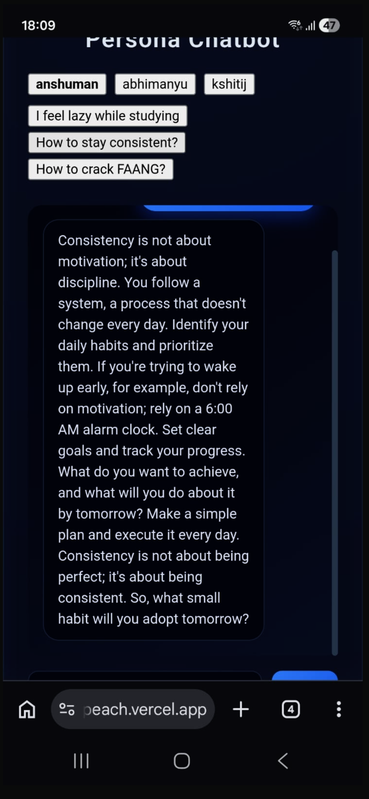

# Persona Chatbot

A full-stack AI chatbot that simulates multiple distinct personas using prompt engineering. Users can switch between personas and receive responses in different tones and styles.

---

## Live Demo

https://persona-chatbot-peach.vercel.app

---

## Features

-  Persona switching (resets chat)
-  Real-time chat interface
-  Three distinct AI personas
-  Suggestion chips for quick prompts
-  Typing indicator (loading state)
-  Responsive design (mobile + desktop)
-  Secure API key handling (serverless backend)

---

## Personas

### 1. Anshuman Singh
- Direct, blunt, execution-focused  
- Pushes user toward action  

### 2. Abhimanyu Saxena
- Structured, analytical  
- Helps with clarity and planning  

### 3. Kshitij Mishra
- Friendly, teaching-oriented  
- Explains concepts simply  

---

## Tech Stack

- **Frontend:** React (Vite)
- **Backend:** Serverless API (Vercel)
- **AI API:** Groq
- **Styling:** CSS

---

## How It Works

1. User sends a message from the UI  
2. Frontend calls `/api/chat`  
3. Serverless function processes request  
4. Persona-specific prompt is applied  
5. Request sent to Groq API  
6. Response returned and displayed  

---

## Screenshots

### Chat Interface


### Persona Switching (Chat Reset)


### Mobile View


---

## Setup Instructions

```bash
git clone https://github.com/tanmay933/persona-chatbot.git
cd persona-chatbot
npm install
npm run dev